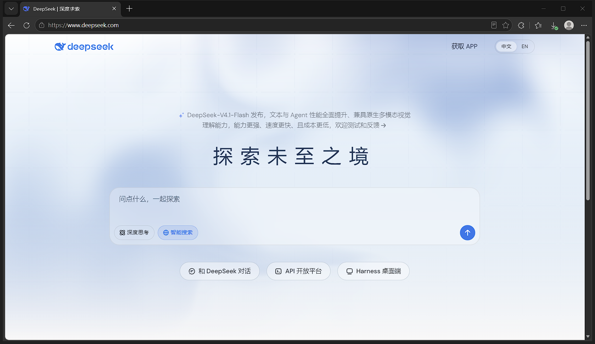

<div align="center">

# 📸 dsh-plugin-screenshot

**面向模型的「截图」工具插件 · DeepSeek Harness（Windows）**

注册一个 `screenshot` 工具，让会话里的 AI 真正「看见」并展示你的屏幕——
不只是全屏，被遮挡、被最小化的窗口也能截。

[](#环境要求)
[](https://github.com/deepseek-ai/deepseek-harness)
[](LICENSE)
[](../../releases)

</div>

---

## ✨ 它解决什么问题

DSH 为「电脑使用」预留了能力位，但桌面版没有自带本机截屏工具。
本插件把这个坑填上，并处理了真实世界里的棘手情况：

| 场景 | 普通 CopyFromScreen | 本插件 |
| --- | :---: | :---: |
| 窗口在屏幕上可见 | ✅ | ✅ |
| 窗口被其他窗口**完全遮挡** | ❌ 截到的是盖在上面的内容 | ✅ `PrintWindow` 让窗口自绘 |
| GPU 渲染应用遮挡后返回**空白帧**（RustDesk / Chrome / Electron…） | — | ✅ 采样检测 + 自动「临时前置」兜底，截完把前台切回去 |
| 窗口**最小化** | ❌ | ✅ 自动还原 → 截图 → 缩回 |
| 缩到托盘（无渲染表面） | ❌ | ⚠️ 明确报错并提示先唤起一次 |
| 远程桌面窗口内容（RustDesk / ToDesk） | 看运气 | ✅ 实测可用 |

## 🚀 安装

```powershell
git clone https://github.com/HsgtLgt/dsh-plugin-screenshot.git
```

在 DSH 插件管理（plugin_manager）中执行 `install_bundle`，指向克隆目录：

```
file:<克隆目录>/dsh-plugin-screenshot
```

重启 DSH 应用即生效。对等依赖 `@deepseek-ai/dsh-tools` / `@deepseek-ai/cordis`
由运行时树提供，无需手动安装。

## 🛠 工具参数

| 参数 | 类型 | 说明 |
| --- | --- | --- |
| `target` | `screen` \| `window` | 截图目标，默认 `screen`（多显示器虚拟桌面） |
| `window_title` | string | `target=window` 时的标题子串匹配（不区分大小写） |
| `output_path` | string | 可选保存路径，相对会话工作区；默认 `screenshots/screenshot-<时间戳>.png` |

模型侧约定（写在工具描述里，自动生效）：
用户点名某个应用时必须用 `window` 模式；截图成功后必须用 `` 内嵌展示。

## 🎬 效果

被完全遮挡的窗口，一行调用直接拿到完整画面（此图即插件自身截取）：



## ⚙️ 实现原理

```text
模型调用 screenshot()
  ├─ ctx.fs.resolve()          相对路径 → 工作区绝对路径
  ├─ ctx.subprocess 启动 PowerShell
  │    Get-Process 标题匹配 → HWND
  │    最小化 → ShowWindow 还原
  │    PrintWindow(PW_RENDERFULLCONTENT) 自绘到位图
  │    采样 100 像素查空白 → 空白则临时前置 + CopyFromScreen
  │    写 PNG → "OK 宽x高 方法"
  ├─ ctx.fs.readBytes()        读回字节
  └─ ctx.attachments.saveImage()  校验/降采样 → 持久对象库
       ↓
  返回 路径信封 + 原生图像块（模型看见 + 用户可见）
```

无原生依赖：只调 Windows PowerShell 与 user32 / System.Drawing。
图片文件永久保留在会话工作区，展示副本由 DSH 附件库按内容寻址去重存储。

## ⚠️ 已知限制

- GPU 硬件渲染的窗口**长期遮挡**后可能拿到过期帧（内容旧但非空白），重截一次即可；
- 从未渲染过内容的隐藏/托盘窗口没有可截表面，会明确报错；
- 仅支持 Windows；模型侧需支持图像输入。

## License

[MIT](LICENSE) © HsgtLgt
